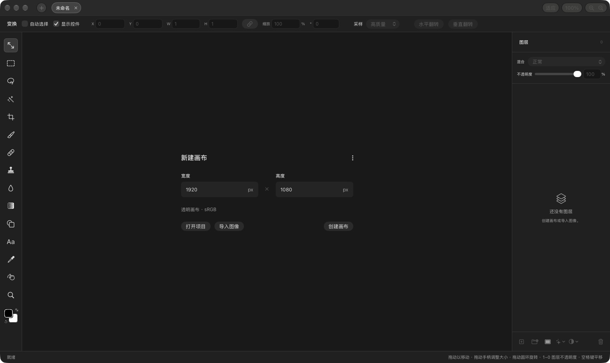

# Compositor 中文版（汉化版）

> **免责声明 / Disclaimer**：本项目为非官方汉化版，与上游作者无关。汉化版的问题请提到[本仓库的 Issues](../../issues)，不要去打扰上游。
>
> This is an **unofficial** Simplified Chinese localization of [robbietilton/Compositor](https://github.com/robbietilton/Compositor), not affiliated with the upstream author. The upstream project is developed by Robbie Tilton and licensed under MIT (see LICENSE).
>
> **下载安装**：见 [Releases](../../releases) 页面的 DMG，提供两个版本：
>
> | 版本 | 文件 | 说明 |
> | --- | --- | --- |
> | 纯汉化版 | `Compositor-1.4.5-CN-L10n.dmg` | 只翻译界面，功能与上游 v1.4.5 完全一致，适合想要「原版体验 + 中文」的用户 |
> | 个人修改版 | `Compositor-1.4.5-CN-Mod.dmg` | 汉化 + 下方「本分支新增功能」的全部内容（印刷尺寸、多格式导出、PDF 导入、移除工具等） |
>
> 因为安装包没有 Apple 开发者签名/公证，首次打开需在「系统设置 › 隐私与安全性」里选择「仍要打开」。
>
> 本分支的差异：
> - 全部界面文字汉化（菜单、面板、弹窗、撤销动作名、PSD 导入报告等，术语对齐 Photoshop 中文版）
> - 项目文件（.comp）与 PSD 的存储格式保持英文不变，与上游完全互通
> - 移除了 Sparkle 自动更新（避免更新回英文版）

## 本分支新增功能

- **印刷尺寸预设**：新建画布的预设菜单新增 A3 / A4 / A5 / A6 / B4 / B5 / 名片，按 300 DPI 印刷标准换算像素
- **多格式导出「导出为…」（⌥⌘E）**：PNG / JPEG / HEIC / TIFF / GIF / BMP / PDF 七种格式，带实时预览、质量滑块（JPEG/HEIC）、文件大小预估、透明区域背景色设置；PNG/HEIC/TIFF/PDF 保留透明
- **PDF 导入**：直接把 PDF 拖入窗口即可打开，多页 PDF 每页自动建成一个图层（如「文档 第 1 页」），按 2 倍（144 DPI）渲染保证清晰度；加密或损坏的 PDF 有中文错误提示
- **移除工具（K）**：对标 Photoshop 的移除工具——在不想要的内容上涂抹，松手后由本地 AI 模型（LaMa，Core ML 加速）按周围背景智能补全，结果写回图层、可 ⌘Z 撤销。模型约 200 MB，首次使用时从本仓库的 Releases 下载一次（带进度、断点续传和 SHA-256 校验），全程离线运行、不上传图像
- **撤销历史内存可调**：设置窗口（⌘,）中可将撤销历史的内存上限在 256 MB – 4 GB 之间调整（默认 1 GB），大图编辑不再轻易丢历史

## 界面截图


 

## 致谢与许可

- [Compositor](https://github.com/robbietilton/Compositor)（MIT）——上游项目，Robbie Tilton
- [swift-inpaint](https://github.com/arraypress/swift-inpaint)（MIT）——移除工具的 Core ML 推理代码（vendored，文件头保留原作者声明）
- [LaMa](https://github.com/advimman/lama)（Apache-2.0）——移除工具的图像修复模型；Release 中的 `LaMa.mlpackage.zip` 为其 Core ML 转换版（源自 [jerhoads/lama-coreml](https://huggingface.co/jerhoads/lama-coreml)）的再分发，Apache-2.0 许可证全文见 [LICENSE-APACHE](LICENSE-APACHE)
>
> 以下为上游原版 README。

---

# Compositor

Adobe Photoshop costs too much and tools like GIMP don’t feel familiar enough for me to stay in flow. That’s why I built Compositor.

The goal was to create a full-featured image editor that is completely free and open source. I used to use Photoshop for compositing and post-processing, so Compositor is built around that workflow - with the tools needed to create a pixel-perfect final image.

Because it’s open source, you can download the Xcode project and add, remove, or modify any feature to fit your workflow.

## Installation

### Download
Get Compositor from [robbietilton.com/compositor](https://robbietilton.com/compositor), or download the latest release directly from [GitHub Releases](https://github.com/robbietilton/Compositor/releases/latest).

### Homebrew

```sh
brew install --cask robbietilton-compositor
```

## Features

### Layers
- Layers and folders, with opacity and Photoshop's full set of blend modes in its order — a folder's opacity dims everything inside it
- Layer masks: paint, fill, invert, blur and feather them anywhere on the canvas, past the layer's own pixels; link or unlink them to transform a mask on its own
- Clipping masks and folder masks
- Adjustment layers: Hue/Saturation, Levels, Curves, Exposure, Gradient Map, Grain, Black & White, Color Balance, Invert, Gaussian Blur, Motion Blur and Noise
- Layer effects: Stroke, Drop Shadow, Color Overlay, Inner Shadow, Outer Glow and Inner Glow, rendered on the GPU and editable at any time
- Merge Down, Merge Layers and Merge Group (⌘E)
- Duplicate, rename inline, reorder and nest by drag and drop; Option-drag to duplicate; a right-click menu in the Layers panel
- Copy and paste whole layers and folders (⌘C/⌘V with no selection), within a project or between projects, or drag them between projects

### Transform
- Non-destructive move, scale, rotate and flip — images keep their full resolution however small you make them
- Free distort (⌘-drag a handle), with Shift to lock to an axis
- Transform several layers, or a whole folder, together
- Snapping to canvas and layer edges and centers, with guides
- Exact values for position, size, scale and angle, stepped with the arrow keys
- Flip Layer and Flip Canvas, horizontal and vertical

### Selections
- Rectangle and Ellipse Marquee, Freehand and Polygonal Lasso, and the Magic tool — Wand selects by color, Object traces whatever you click (Tab switches)
- Select Subject, and Expand, Contract and Feather on any selection
- Add to and subtract from selections, move the outline, or move and duplicate the pixels inside
- Load a layer's pixels or a mask as a selection
- Content-Aware Fill, which can also extend an image past its edges

### Painting and retouching
- Brush with size, hardness, opacity and smoothing, in Paint or Erase mode (B and E), and Shift for straight lines
- Spot Healing Brush (content-aware)
- Clone Stamp, aligned or not, sampling one layer or all of them
- Blur tool, on pixels or masks
- Gradient tool and Shape tool (rectangles, rounded rectangles, ellipses and lines), which stay editable rather than being rasterized
- Type tool (T): inline multiline editing in draggable, resizable paragraph boxes; font, size, color, alignment and spacing in the tool header; transform text and use it as a clipping mask
- Eyedropper and a full color picker

### Adjustments and filters
- Camera Raw filter: light, color, curves, color mixer, color grading, detail, optics and geometry, in a panel beside the canvas
- Levels (with Auto), Curves, Hue/Saturation, Exposure, Gradient Map, Grain, Black & White, Color Balance and Invert
- Gaussian Blur and Motion Blur that spread past a layer's edges
- Add Noise, Vignette, Bloom / Glow, Tonal Contrast, Lens Correction and Remove Background
- Live previews, limited to the selection when there is one

### Canvas and files
- Multiple projects in tabs
- Rulers (⌘R), guides dragged from them, a layout grid with adjustable spacing and subdivisions, and Snap To for guides, grid, layers and document bounds
- Crop with snapping, ratios including 3:4 and 9:16, and Option for symmetric cropping; with a selection, the crop starts at it
- Canvas Size, Image Size and Trim
- Sharp high-quality downsampling when zoomed out, and a pixel grid when zoomed in
- Import JPEG, PNG, HEIC, TIFF, SVG, camera RAW (with a develop step first) and Photoshop PSD and PSB (8-bit RGB; not CMYK). Photoshop folders, masks, blend modes, fill rectangles/ellipses, and simple horizontal text stay editable; other vectors and vertical text become pixels. A conversion report is shown before anything is applied.
- Large documents: the memory budget scales with your Mac, and a Photoshop file too big to open has its layers cropped to the canvas instead
- Export JPEG with a live preview (⇧⌥⌘S); Copy Merged
- Keep working while a project saves
- Photoshop-style keyboard shortcuts throughout, remappable in Edit > Keyboard Shortcuts
- Drag a number's label to scrub its value, as in Photoshop
- Automatic updates, signed and notarized

### Works with AI agents
- AI agents and scripts can build and edit projects directly: a `.comp` is a folder of PNG layers and a manifest, and an open project updates live as it's written. See [Writing Compositor projects](docs/writing-comp-files.md)

## Requirements

- macOS 26.0 or later on a Mac with Apple silicon
- Xcode 26 or later (to build from source)

## Building

Open `Compositor.xcodeproj` and run the **Compositor** scheme.

## Releasing

`scripts/release.sh` builds a Release version, signs it with Developer ID, notarizes and staples it, and packages it into `dist/Compositor-<version>.dmg`.

It needs, all kept outside this repository:

- a **Developer ID Application** certificate in the login keychain
- notarization credentials saved with `xcrun notarytool store-credentials "compositor-notary" …`
- [`create-dmg`](https://github.com/create-dmg/create-dmg) (`brew install create-dmg`)

## License

MIT — see [LICENSE](LICENSE).
